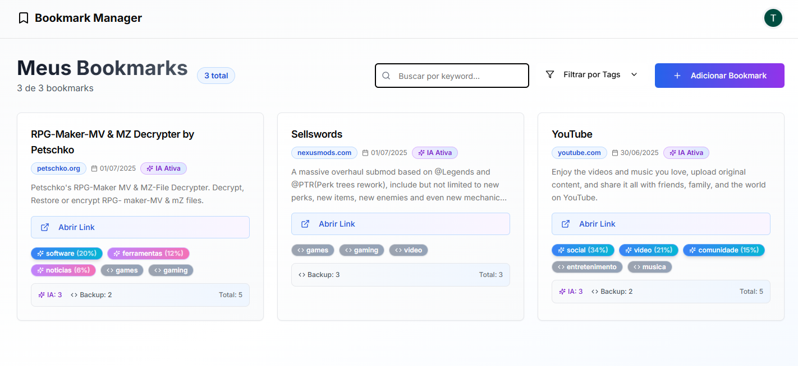

# Projeto final: Aplicação com login federado e API para serviço de IA

Acesso: https://project4-2025a-thales.vercel.app/

### Desenvolvedores
Thales de Vargas Stamm - Sistemas de Informação

### Nosso produto

O "Bookmark AI" é uma aplicação web moderna criada para resolver um problema comum: salvar links interessantes e depois lembrar facilmente do que se tratam. O objetivo é ir além de um simples gerenciador de favoritos, utilizando Inteligência Artificial para enriquecer cada link salvo, tornando a organização e o cadastro de links muito mais eficiente.

As principais funcionalidades são:

Autenticação Segura: O usuário pode criar uma conta com e-mail e senha ou usar o login federado com sua conta do Google.

CRUD Completo de Bookmarks: É possível criar, visualizar, editar e deletar bookmarks.

Análise Inteligente com IA: O grande diferencial é a integração com Inteligência Artificial. Ao colar uma URL, a aplicação:

Sugere uma descrição: A IA lê o conteúdo da página e gera um resumo conciso e informativo.

Sugere tags relevantes: Outra IA analisa o texto e sugere tags de categorização, facilitando a filtragem e a organização dos links salvos. No caso de falha da IA (mais comum do que eu gostaria), temos um plano backup.

### Desenvolvimento

O projeto foi iniciado com  Next.js 14  e Prisma, com o objetivo de criar uma aplicação robusta e escalável. A interface foi construída inicialmente com componentes básicos para funcionalidade e após foi aprimorada com componentes criados pela v0.

A implementação da autenticação foi feita com o NextAuth.js, oferecendo tanto o login com credenciais (protegido por hash com bcryptjs) quanto o login federado com o Google, garantindo flexibilidade e segurança para o usuário.

O maior desafio e também a parte mais interessante do projeto foi a integração com os serviços de IA. A ideia inicial era usar um único modelo de linguagem (como o google/flan-t5-base) para extrair título, descrição e tags. No entanto, durante os testes, enfrentei vários desafios, mas o principal foi um suposto "bloqueio de rede" que retornava erros 404 Not Found para esse modelo específico (e outros parecidos), mesmo com o código e as chaves de API corretos.

Após um processo de depuração guiado por IA, usando ferramentas como Invoke-WebRequest (PowerShell) para isolar o problema, ficou claro que era um bloqueio  específico e a solução rápida foi adotar outra abordagem. Então foram separadas as tarefas, na tentativa de utilizar duas IAs diferentes:

facebook/bart-large-cnn: Um modelo que é especialista em sumarização, visando gerar a parte de descrição dos bookmarks.

facebook/bart-large-mnli: Um modelo de Zero-Shot Classification, para analisar o conteúdo, realizar uma avaliação de scores para atribuir tags relevantes a partir de uma lista de candidatos.

Para "alimentar" essas IAs, comecei passo a passo com web scraping, mas logo tive que recorrer a soluções online ou a ajuda da IA.

No começo do minha jornada o modelo de IA acabava retornando a resposta toda bagunçada ou como se ele não entendesse o "prompt" passado a ele, para isso foram necessárias algumas adaptações.

Foi necessário refinar a lógica inicial de web scraping com Cheerio para extrair um conteúdo textual limpo e estruturado das páginas, garantindo que as IAs recebessem um input um pouco melhor para trabalhar. Mesmo aprimorando, ainda sinto que não foi o suficiente, o score inicial mínimo para uma tag ser avaliada como relevante era 30%, tive que baixar para 15% e no fim pedi para que as 3 tags com maior relevancia fossem mostradas, independetemente da %, para motivos de preenchimento de informação. Pedi ajuda a IA e ela me recomendou criar um sistema de fallback, onde, mesmo sem a utilização da IA (que falhava em um bom número de chamadas), as tags seriam preenchidas dentro de um certo contexto (uma lista de domínios "conhecidos" que foram definidos), um exemplo seria o github, onde tags de programacao e codigo já seriam atribuidas, e também, se por exemplo, temos uma palavra tutorial dentro do texto da página trazido pelo web scraping, as tags tutorial e educacao seriam recomendadas (no exemplo tudo isso já estaria especificado em código para saber desse relacionamento). No final juntamos todas essas tags, quando não há a disponibilidade da IA naquele momento, e formamos uma sugestão para o usuário baseada em regras pré-definidas.

#### Tecnologias

Frontend: Next.js, Tailwind CSS

UI: Shadcn/UI, Lucide React (ícones)

Backend & Autenticação: NextAuth.js, Bcrypt.js

Banco de Dados: Prisma (ORM), PostgreSQL

Inteligência Artificial: Hugging Face Inference API, utilizando os modelos:

facebook/bart-large-cnn (para sumarização/descrição)

facebook/bart-large-mnli (para classificação/tags)

Web Scraping: Axios, Cheerio

Hospedagem: Vercel (Aplicação) e Render (Banco de Dados PostgreSQL)

#### Ambiente de desenvolvimento

Editor de Código: VS Code

Controle de Versão: Git e GitHub

#### Referências e créditos

Assistência de IA (Gemini): Gemini me auxiliou durante todo o desenvolvimento, mas principalmente nessas etapas:

Comparações entre modelos de IA e implementação dos modelos do Hugging Face.

Depuração dos problemas em geral e também dos problemas de conexão com a API (os erros 403 e 404).

Estruturação do código da API Route (route.ts) para ser mais robusto.

Desenvolvimento de uma lógica de web scraping mais eficaz.

Quando decidi dividir as tarefas entre duas IAs.

Geração de Código Inicial: A estrutura inicial de alguns componentes da interface e também aprimoramento dos componentes antigos foi gerada com a ajuda do v0.dev.

Documentações: Consultei as documentações do Next.js, Prisma, NextAuth.js e Shadcn/UI.

Vídeo sobre modelos do hugging face (acesso inicial): https://www.youtube.com/watch?v=DVLsURxTEtE

Também consultei um vídeo (e tive ajuda da IA) para implementar o login via google, mas não me recordo o link.

Modelos no Hugging Face:

facebook/bart-large-cnn

facebook/bart-large-mnli
---
Projeto entregue para a disciplina de [Desenvolvimento de Software para a Web](http://github.com/andreainfufsm/elc1090-2025a) em 2025a
